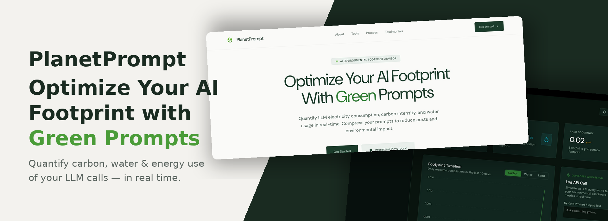

<p align="center">
  
</p>

<h1 align="center">PlanetPrompt</h1>

<p align="center">
  Every prompt has a price. Now you can see it.
</p>

<p align="center">
  
</p>

---

## About

PlanetPrompt is a developer-first transparency layer that tracks the real cost of AI usage — not just in dollars, but in **carbon**, **water**, and **land**. It sits between your team and your AI APIs, logging every query and converting it into the three planetary resources it consumed.

A coal-powered data centre in Virginia costs differently than a hydro-powered one in Norway — PlanetPrompt knows the difference.

The smart prompt advisor analyses your draft before you send it, suggests a leaner rewrite, and tells you exactly how much resource you'd save. Over time, your dashboard builds a living picture of your organisation's AI footprint — ready for ESG reports, team retrospectives, or just the uncomfortable realisation that last Tuesday's image generation batch used as much water as 40 showers.

## Features

- **Real-Time Footprint Tracking** — Log every LLM API call and instantly see its carbon (g CO₂e), water (ml), and land (cm²) footprint based on model-specific conversion factors stored in the database.

- **Smart Prompt Advisor** — Paste a prompt, pick a target model, and let the AI rewrite engine compress your tokens by up to 40% while preserving intent. Side-by-side comparison shows exactly what you save.

- **Monthly ESG Reports** — Auto-generated sustainability summaries with impact equivalence benchmarks (electric vehicle distance, smartphone charges, water bottles) to make abstract numbers tangible.

- **Developer Playground** — Simulate queries, estimate tokens as you type, and log results to the dashboard without ever hitting a production API.

- **Dynamic Model Profiles** — Model configurations (Claude 3.5 Sonnet, GPT-4o, Llama 3 70b) are stored in the database with per-model carbon, water, and land conversion rates.

- **Dark / Light Theme** — A clean forest-green dark theme by default with a one-click toggle to a cream-and-mint light theme. Preference persists across sessions via localStorage.

- **Organization Support** — Clerk-powered authentication with organization switching and role-based navigation for team-wide deployment.

## Tech Stack

| Layer | Technology |
|---|---|
| Framework | Next.js 16 (App Router) |
| Language | TypeScript |
| Styling | Tailwind CSS v4 + CSS custom properties |
| Font | DM Sans (variable, self-hosted) |
| Auth | Clerk (with Organizations) |
| Database | Neon PostgreSQL |
| ORM | Prisma |
| Charts | Recharts |
| Icons | Lucide React |
| AI | Hugging Face Inference API |

## Getting Started

### Prerequisites

- Node.js 18+
- A [Neon](https://neon.tech) PostgreSQL database
- A [Clerk](https://clerk.com) application (with Organizations enabled)
- A [Hugging Face](https://huggingface.co) API token

### Installation

```bash
# Clone the repository
git clone https://github.com/PratyushPanda2005/planet-prompt.git
cd planet-prompt

# Install dependencies
npm install
```

### Environment Variables

Create a `.env` file in the root directory:

```env
DATABASE_URL="your-neon-connection-string"
CLERK_SECRET_KEY="your-clerk-secret-key"
NEXT_PUBLIC_CLERK_PUBLISHABLE_KEY="your-clerk-publishable-key"
NEXT_PUBLIC_CLERK_SIGN_IN_URL="/sign-in"
NEXT_PUBLIC_CLERK_SIGN_UP_URL="/sign-up"
HF_API_TOKEN="your-huggingface-token"
```

### Database Setup

```bash
# Push the Prisma schema to your Neon database
npx prisma db push

# Seed model configurations and sample data
npx prisma db seed
```

### Run Locally

```bash
npm run dev
```

Open [http://localhost:3000](http://localhost:3000) to see the landing page.

## Project Structure

```
planet-prompt/
├── app/
│   ├── (auth)/              # Clerk sign-in / sign-up routes
│   ├── (dashboard)/
│   │   ├── layout.tsx       # Sidebar shell with theme toggler
│   │   ├── dashboard/       # Main analytics dashboard
│   │   ├── advisor/         # Smart prompt optimization page
│   │   └── report/          # Monthly ESG impact reports
│   ├── api/
│   │   ├── logs/            # GET/POST query log endpoints
│   │   ├── models/          # GET available model configs
│   │   ├── optimize/        # POST prompt optimization
│   │   └── report/          # GET/POST monthly reports
│   ├── globals.css          # Theme variables & utilities
│   ├── layout.tsx           # Root layout with DM Sans font
│   └── page.tsx             # Landing page
├── prisma/
│   ├── schema.prisma        # Database schema
│   └── seed.ts              # Seed script for models & sample data
└── public/
    ├── logo.png             # PlanetPrompt logo
    ├── planetprompt_website_banner.png
    └── fonts/               # DM Sans variable font
```

## License

This project is open source and available under the [MIT License](LICENSE).